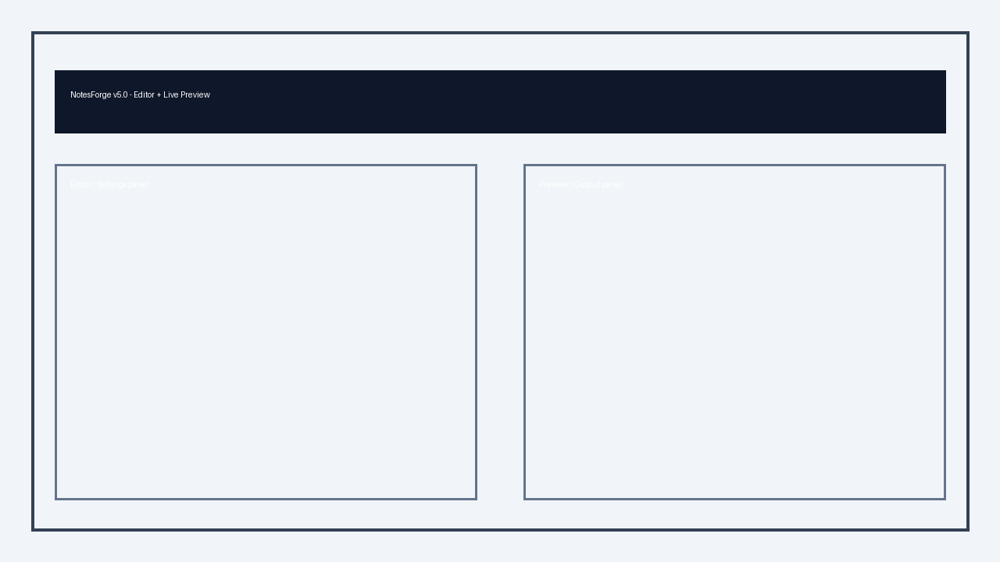
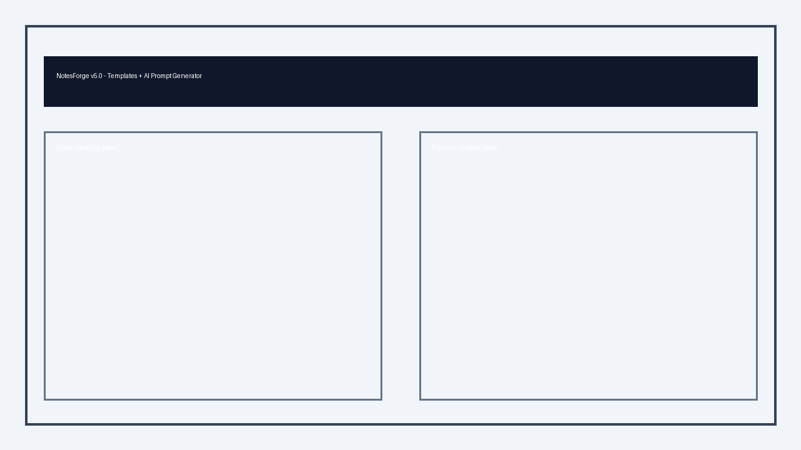
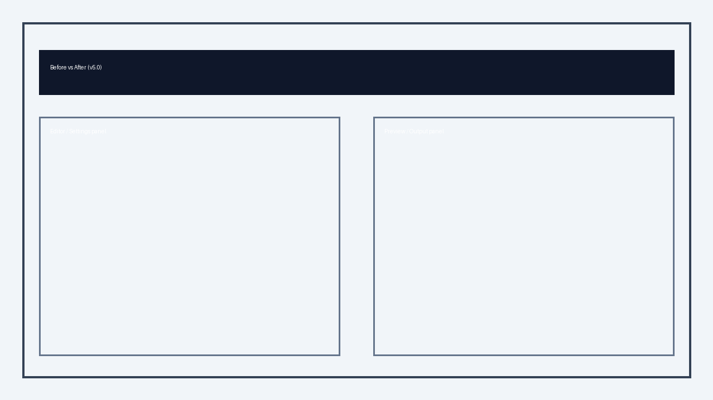
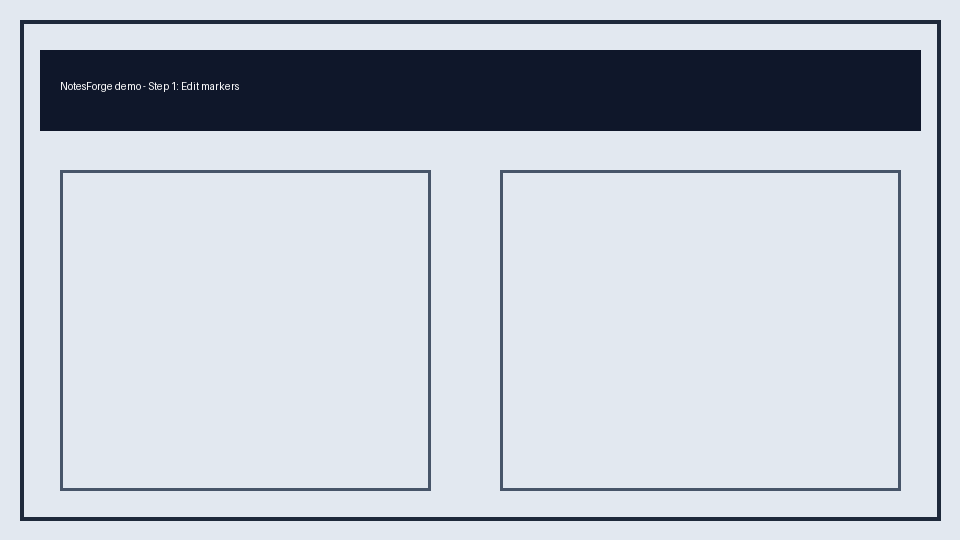

# NotesForge v5.0
Transform any text into professional Word/PDF documents — React + FastAPI document formatter with marker-based parsing, live preview, themes, and AI-driven templates.

## Overview
NotesForge v5.0 is a contract-first document automation platform.

- Frontend: React + TypeScript (strict mode), live split experience, mobile tabs.
- Backend: FastAPI + modular parser/theme/template/export/security services.
- Syntax: NotesForge marker format (`H1`-`H6`, `PARAGRAPH`, `BULLET`, `NUMBERED`, `TABLE`, `CODE`).
- Output: `docx`, `pdf`, `html`, `md`, `txt`.

### Demo Assets
- Editor screenshot: 
- Templates screenshot: 
- Export screenshot: 
- Before/After: 
- GIF main flow: 

## Quick Start
### Prerequisites
- Python 3.11+
- Node.js 18+
- npm

### 1) Install backend
```powershell
cd backend
python -m venv .venv
. .venv/Scripts/Activate.ps1
python -m pip install --upgrade pip
python -m pip install -r requirements.txt
```

### 2) Install frontend
```powershell
cd ../frontend
npm install
```

### 3) Environment
Copy `.env.example` and set values:

- Frontend: `VITE_API_URL`
- Backend: `FASTAPI_HOST`, `FASTAPI_PORT`, `DOCX_TEMP_DIR`, `STORAGE_BACKEND`, `NF_CORS_ORIGINS`

### 4) Run
Use startup script (fixed with relative path):
```bat
START.bat
```

Or run manually:
```powershell
# backend
cd backend
python backend_server.py

# frontend
cd ../frontend
npm run dev
```

## Architecture
- Architecture diagram SVG: [docs/architecture.svg](docs/architecture.svg)
- Architecture diagram PNG: [docs/architecture.png](docs/architecture.png)

High-level flow:
1. Frontend sends marker content + theme JSON + options.
2. FastAPI parser builds AST and summary metrics.
3. Theme engine maps theme JSON to preview CSS and document style mapping.
4. Export module generates DOCX/PDF/HTML/MD/TXT and stores with TTL cleanup.
5. Security module applies metadata stripping, PDF password, DOCX read-only.
6. Download endpoint serves generated file by `fileId`.

## API contract
### 1) GET `/api/health`
Response:
```json
{"status":"ok"}
```

### 2) POST `/api/preview`
Request JSON:
```json
{
  "content": "string (NotesForge markers)",
  "theme": { "name":"", "primaryColor":"#hex", "fontFamily":"", "headingStyle": {}, "bodyStyle": {} },
  "formattingOptions": { "margins": { "top":0, "bottom":0, "left":0, "right":0 }, "lineSpacing": 1.4 },
  "security": { "removeMetadata": true, "watermark": { "type":"text", "value":"", "position":"center" } }
}
```
Response:
```json
{
  "previewHtml": "string (sanitized HTML)",
  "warnings": ["string"],
  "structure": {
    "wordCount": 0,
    "headingCount": 0,
    "readingTimeMinutes": 0.0
  }
}
```

### 3) POST `/api/generate`
Request JSON:
```json
{
  "content": "...",
  "theme": {},
  "format": "docx|pdf|html|md|txt",
  "filename": "notesforge_output",
  "security": { "passwordProtectPdf": "optional", "disableEditingDocx": false, "removeMetadata": true },
  "templateId": "optional"
}
```
Response:
```json
{
  "downloadUrl": "/api/download/{fileId}",
  "fileId": "string"
}
```

### 4) GET `/api/templates`
Response:
```json
[
  {
    "id":"string",
    "name":"Report",
    "description":"",
    "defaultTheme": {},
    "sampleContent":"string",
    "aiPromptTemplate":"string with {topic}"
  }
]
```

### 5) POST `/api/templates/regenerate`
Request:
```json
{ "templateId":"", "topic":"string", "aiProvider":"chatgpt|notebooklm|claude" }
```
Response:
```json
{ "content":"generated notesforge content", "prompt":"full prompt used" }
```

### 6) POST `/api/themes`
Request:
```json
{ "name":"", "primaryColor":"", "fontFamily":"", "styles": {} }
```
Response:
```json
{ "themeId":"" }
```

### 7) GET `/api/health/parser`
Response:
```json
{ "parser":"ok", "version":"x.y" }
```

## Themes
### Professional theme JSON sample
```json
{
  "name":"Professional",
  "primaryColor":"#1F3A5F",
  "fontFamily":"Calibri, Arial, sans-serif",
  "headingStyle": {
    "h1": {"size":24, "weight":"700", "color":"#1F3A5F"},
    "h2": {"size":20, "weight":"600"}
  },
  "bodyStyle": {"size":11, "lineHeight":1.4},
  "tableStyle": {"borderWidth":1, "borderColor":"#ddd", "headerFill":"#f6f6f6"},
  "margins": {"top":25,"bottom":25,"left":25,"right":25}
}
```

## Templates
Templates implemented by `/api/templates`:

1. `assignment`: Academic assignment/report layout.
2. `resume`: One-page resume layout.
3. `report`: Professional report.
4. `meeting`: Meeting minutes template.
5. `cybersec`: Cybersecurity incident/audit report.

Sample content file:
- [examples/SAMPLE_EXAMPLE.notesforge](examples/SAMPLE_EXAMPLE.notesforge)

Regeneration prompt format used:
```text
Using NotesForge marker syntax (H1–H6, PARAGRAPH, BULLET, NUMBERED, TABLE, CODE), generate a structured document about '{topic}' for the '{templateName}' template. Keep sections concise, include sample TABLE and CODE if relevant, and ensure the content is deterministic. Output ONLY NotesForge markers content, no commentary.
```

## Deploy
### Frontend
- Deploy to Vercel.
- Set `VITE_API_URL` to your backend URL.

### Backend
- Deploy FastAPI with Uvicorn/Gunicorn.
- Configure `FASTAPI_HOST`, `FASTAPI_PORT`, `DOCX_TEMP_DIR`, `STORAGE_BACKEND`.
- Set `NF_CORS_ORIGINS` to include frontend origin(s).
- Vercel frontends are accepted by default via origin regex.

## Contribute
1. Fork and clone.
2. Create a feature branch.
3. Run tests:
   ```powershell
   cd backend
   pytest
   ```
4. Run frontend type/build:
   ```powershell
   cd ../frontend
   npm run build
   ```
5. Open a pull request with a concise summary and screenshots for UI changes.

## Release notes (v5.0)
- New theme engine (frontend + backend reflection).
- Template system with AI regeneration endpoint.
- Live split preview with 500ms debounced API updates and local offline fallback.
- Export pipeline for DOCX/PDF/HTML/MD/TXT with security controls.
- Mobile-responsive UI tabs and improved project documentation/demo assets.

## License
MIT. See [LICENSE](LICENSE).
